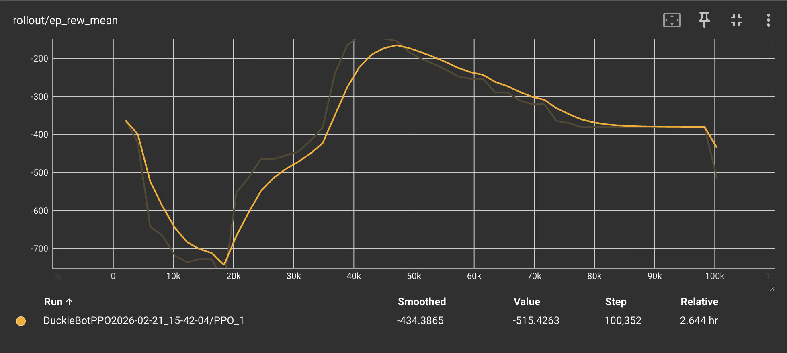
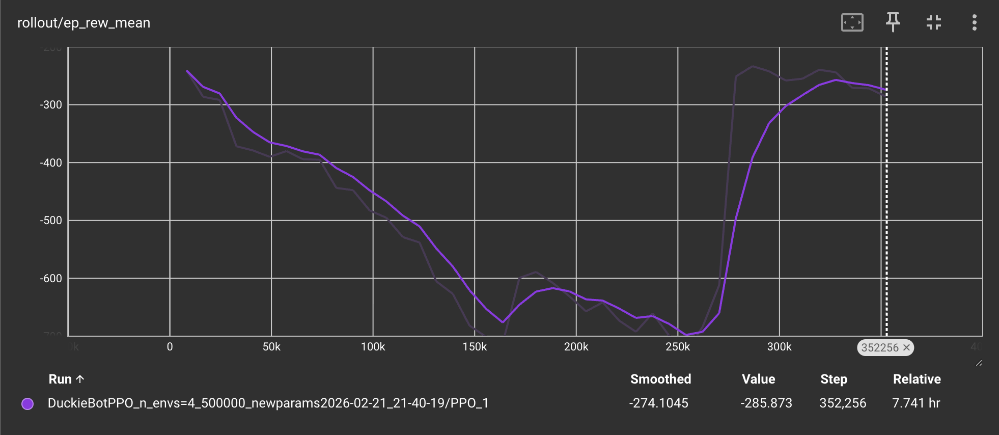
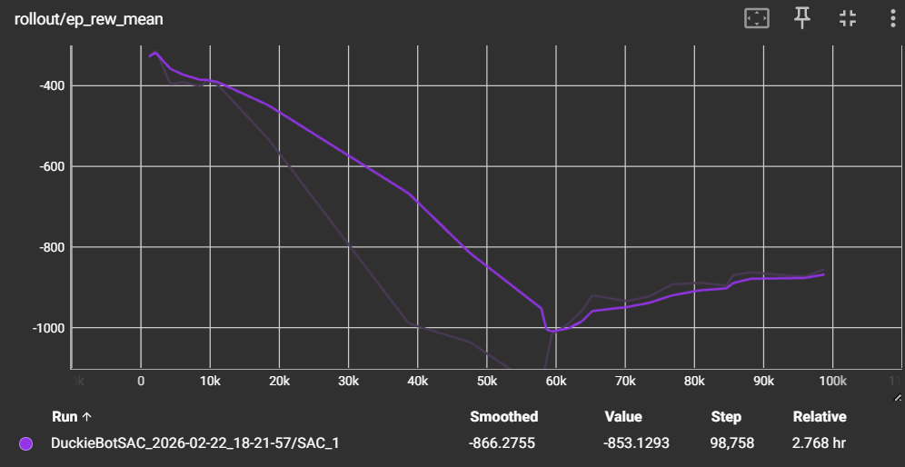
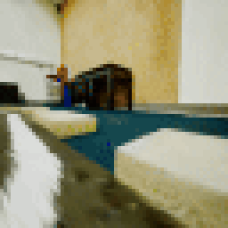
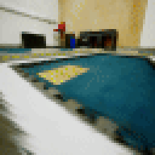

# Final Report

## Project Summary
Our project aims to develop an autonomous navigation system for a Duckiebot within the simulated Duckietown environment.
We strive to create a system with a strong emphasis on safety and adaptability.
With the current environment we are aiming for the agent to reliably preform lane following, staying reasonably centered throughout the entire route, from start to finish.
A 160x120 RGB visual feed is the primary input for the Duckiebot and provides the agent with critical context regarding lane positioning.
Based on the camera feed the system produces a continuous output in the form of linear and angular velocity commands to control the Duckiebot's movement, allowing it to navigate the field safely and responsivley.
Aiming to transfer the training agent to the physical Duckiebot we are comparing different RL algorithms to compare and discover which will give us the best result. 

## Approach

Our team implemented and compared two distinct reinforcement learning approaches for autonomous driving in the Duckiebot simulator to identify the most robust solution for continuous action spaces. We focused on comparing an on-policy method, **Proximal Policy Optimization (PPO)**, with an off-policy method, **Soft Actor-Critic (SAC)**.

### Proximal Policy Optimization (PPO)
PPO was our primary method, chosen for its training stability. It utilizes a clipped objective function to prevent the policy from changing too drastically in a single update:

$$L^{CLIP}(\theta) = \hat{\mathbb{E}}_t \left[ \min(r_t(\theta) \hat{A}_t, \text{clip}(r_t(\theta), 1 - \epsilon, 1 + \epsilon) \hat{A}_t) \right]$$

Where $r_t(\theta)$ is the probability ratio, and $\hat{A}_t$ is the estimated advantage at time $t$.

### Soft Actor-Critic (SAC)
SAC was chosen for its superior sample efficiency in continuous action spaces. Unlike PPO, SAC aims to maximize both the expected reward and entropy to encourage exploration and prevent premature convergence:

$$J(\pi) = \sum_{t=0}^{T} \mathbb{E}_{(s_t, a_t) \sim \rho_\pi} [r(s_t, a_t) + \alpha \mathcal{H}(\pi(\cdot|s_t))]$$

Where $\mathcal{H}$ denotes the entropy and $\alpha$ is the temperature parameter.

---

### Implementation Details

#### 1. Observation & Action Space
* **Observations**: Raw images are resized and normalized to $64 \times 64 \times 3$. We utilize `VecTransposeImage` to convert data to a channel-first format and `VecFrameStack` with `n_stack=4` to allow the agent to perceive temporal information (motion and velocity) from consecutive frames.
* **Actions**: A continuous space representing `[linear_velocity, angular_velocity]`, with both values clipped between $[-1.0, 1.0]$.

#### 2. Advanced Reward Shaping
We implemented a custom `ImageWrapper` to refine the reward signal, transitioning from basic penalties to a sophisticated multi-weighted function:
* **Progress (Weight: 3.0)**: Positive reward based on `forward_vel` to encourage forward movement and overcome the "stagnation trap" of spinning in place.
* **Alignment (Weight: 1.5)**: Penalty based on `yaw_vel` to keep the Duckiebot aligned with the lane center.
* **Smoothness (Weight: 0.8)**: Penalty applied to the magnitude of steering changes (`turn_jerk`) to prevent aggressive "wobbling."
* **Spin Penalty (Weight: 0.4)**: Specifically penalizes high angular velocity to discourage the agent from simply rotating to avoid collision rewards.
* **Momentum Bonus**: A $+0.2$ bonus applied when `forward_vel > 0.3` and `abs(yaw_vel) < 0.3` to encourage stable, high-speed lane following.
* **Termination**: A large penalty ($-5.0$ to $-100.0$ depending on the version) and episode termination upon collision with lane boundaries.

---

### Hyperparameter Configurations

We evolved our hyperparameters across multiple training runs to find the best balance between exploration and stability. Our tuning process was split between optimizing PPO for long-term navigation and managing memory constraints for SAC.

#### 1. Proximal Policy Optimization (PPO)
Our final PPO configuration focused on increasing the batch size and learning rate to handle the high-dimensional input from the $64 \times 64 \times 3$ image wrapper.

| Hyperparameter | Value | Rationale |
| :--- | :--- | :--- |
| **Learning Rate** | $3 \times 10^{-4}$ | Increased from $1 \times 10^{-4}$ to accelerate convergence with custom rewards. |
| **n_steps** | $2048$ | Increased from $1024$ to provide more stable gradient estimates per update. |
| **Batch Size** | $128$ | Increased from $64$ to improve update stability in continuous action spaces. |
| **ent_coef** | $0.05$ | Set high to ensure the agent explored forward movement instead of spinning. |
| **Total Timesteps** | $2,000,000$ | Extended training duration to ensure behavior stabilization. |

**PPO Tuning Process:**
The primary challenge with PPO was the "stagnation trap," where the agent would spin in place to avoid collision penalties. By increasing the entropy coefficient ($ent\_coef$) to $0.05$ and adjusting the reward weights for forward progress, we forced the agent to explore the lane boundaries more effectively.

#### 2. Soft Actor-Critic (SAC)
Our final PPO configuration focused on increasing the batch size and learning rate to handle the high-dimensional input from the $64 \times 64 \times 3$ image wrapper.

| Hyperparameter | Value | Rationale |
| :--- | :--- | :--- |
| **Learning Rate** | $3 \times 10^{-4}$ | Increased from $1 \times 10^{-4}$ to accelerate convergence with custom rewards. |
| **n_steps** | $2048$ | Increased from $1024$ to provide more stable gradient estimates per update. |
| **Batch Size** | $128$ | Increased from $64$ to improve update stability in continuous action spaces. |
| **ent_coef** | $0.05$ | Set high to ensure the agent explored forward movement instead of spinning. |
| **Total Timesteps** | $2,000,000$ | Extended training duration to ensure behavior stabilization. |

**PPO Tuning Process:**
The primary challenge with PPO was the "stagnation trap," where the agent would spin in place to avoid collision penalties. By increasing the entropy coefficient ($ent\_coef$) to $0.05$ and adjusting the reward weights for forward progress, we forced the agent to explore the lane boundaries more effectively.

## Evaluation
We evaluated our three configurations based on quantitative training logs and qualitative driving performance.

### 1. Quantitative Results
The training progress revealed distinct learning behaviors across the three configurations:

| Metric | Baseline PPO | Tuned PPO | SAC |
| :--- | :--- | :--- | :--- |
| **Final Smoothed Reward** | -434.38 | **-274.10** | -866.27 |
| **Training Steps** | 100,352 | 352,256 | 98,758 |
| **Recovery Status** | Partial / Plateau | **Significant Breakthrough** | Early Stabilization |

#### Baseline PPO Performance:

The **Baseline PPO** showed an early struggle, with the reward dropping nearly to $-750$ within 20k steps. While it recovered to around $-180$ mid-training, it eventually decayed and plateaued at **-434.38**, indicating it failed to find a long-term stable policy for the environment.

#### Tuned PPO Performance:
  

Our **Tuned PPO** demonstrated a superior recovery capability. After an extensive exploration phase that dipped to $-700$, the agent achieved a major breakthrough around **260k steps**. It stabilized at a significantly higher smoothed reward of **-274.10**, proving that our hyperparameter adjustments directly improved the agent's ability to learn from road boundary penalties.

#### SAC Performance:

The **SAC** agent initially struggled with higher entropy exploration, with rewards dropping to nearly $-1000$ around 60k steps. However, it showed a clear upward trend in the final 30k steps, reaching **-866.27**. While the reward is lower than PPO at this stage, the trajectory suggests potential for continued improvement with more training steps.

### 2. Qualitative Results
We analyzed the agent's behavior through visual captures to identify failure modes and successes.

 

**Baseline PPO (Stagnation Mode)**: We observed that the Baseline PPO agent developed a "safe" but useless strategy of **spinning in place**. By doing so, it avoids crossing the lane boundaries and incurring the heavy $-100.0$ penalty, but it fails to make any forward progress.

**Tuned PPO (Success Mode)**: 
* **Dynamic Recovery**: Unlike the baseline models, the Tuned PPO agent demonstrates a sophisticated understanding of the environment by making continuous, fine-grained steering adjustments to stay centered.
* **Effective Progress**: After reaching the convergence point, the agent overcame the "stagnation" trap; it actively moves forward with linear velocity while successfully interpreting the $64 \times 64$ RGB input to anticipate upcoming curves.
* **Stability**: The agent maintains a stable trajectory even as training progresses, proving that our tuning effectively balanced exploration with exploitation.

**SAC (Exploration Mode)**: The SAC agent currently exhibits **wandering behavior**, moving near the starting area but without a clear sense of direction. While it is more active than the Baseline PPO, it has not yet learned to correlate visual inputs with the long-term goal of lane following.

## Resources Used
- SAC Documentation: https://stable-baselines3.readthedocs.io/en/master/modules/sac.html
- PPO Documentation: https://stable-baselines3.readthedocs.io/en/master/modules/ppo.html
- duckiebotssim : https://gitlab.jblanier.net/sim2real/duckiebotssim/-/tree/master
- AI Tools: We utilized Generative AI tools (Gemini/ChatGPT) to assist in debugging the `duckiebotssim` environment wrappers and to troubleshoot errors within our reinforcement learning training scripts.

## Progress Video
<iframe width="560" height="315" src="https://www.youtube.com/embed/-cZzBRPxu5M?si=gbzZBSAsnnrsB-rR" title="YouTube video player" frameborder="0" allow="accelerometer; autoplay; clipboard-write; encrypted-media; gyroscope; picture-in-picture; web-share" referrerpolicy="strict-origin-when-cross-origin" allowfullscreen></iframe>