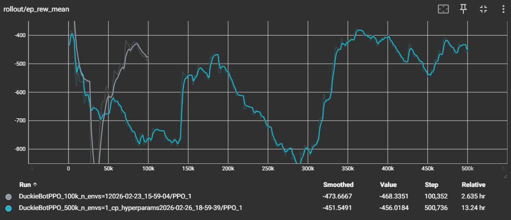
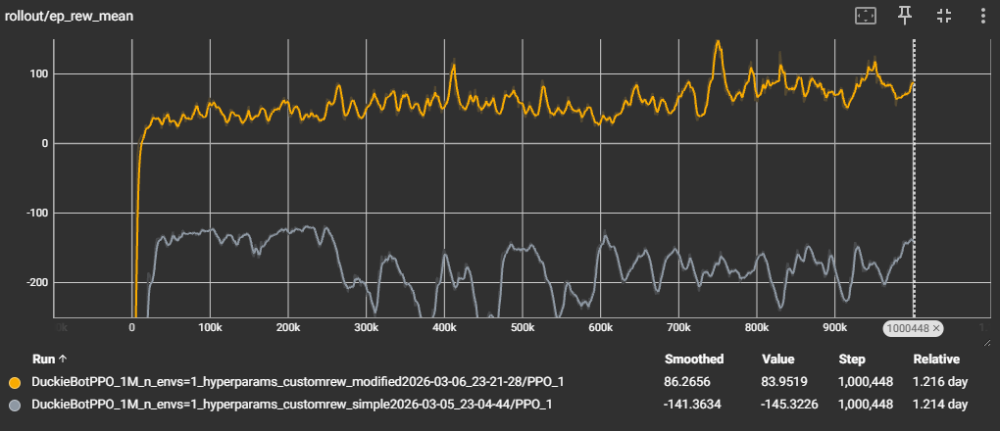
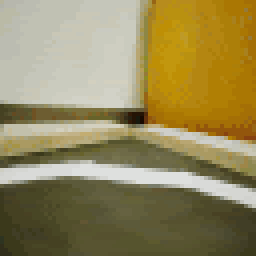
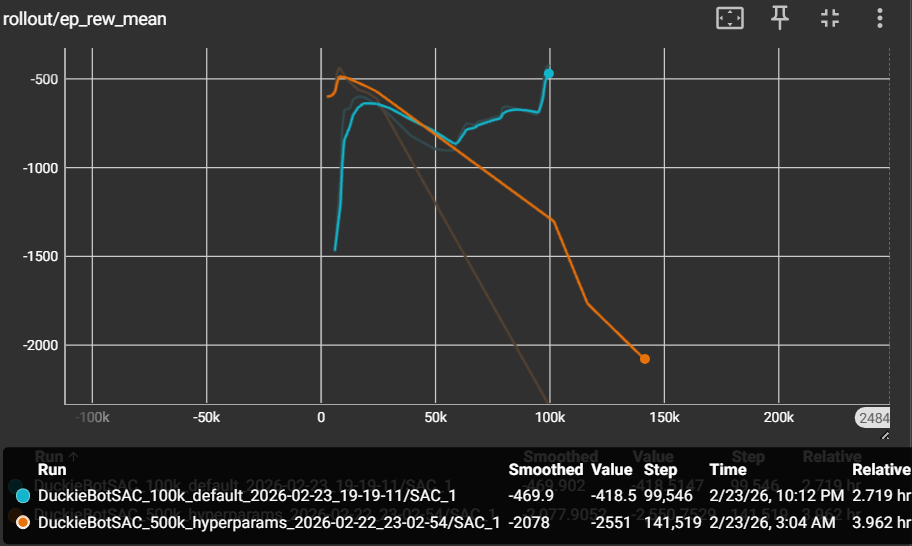
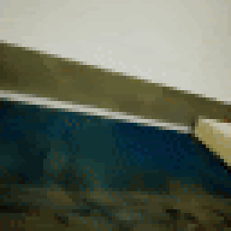
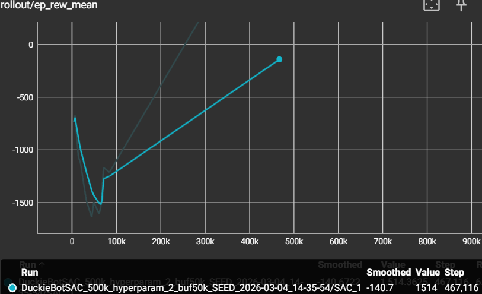
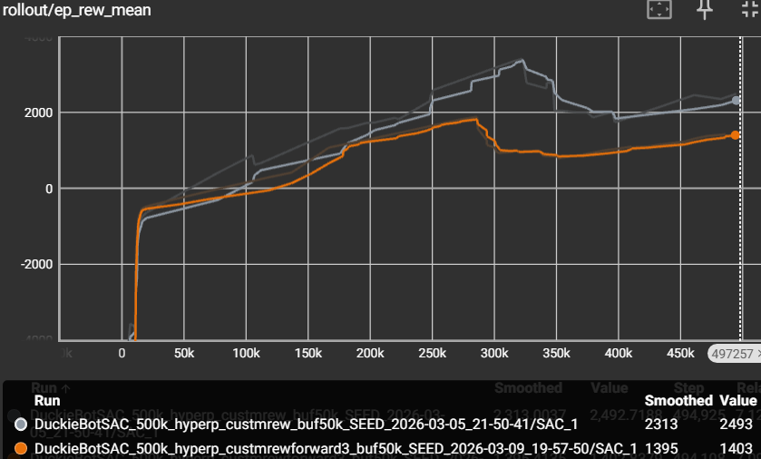
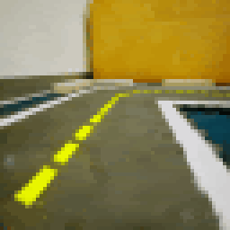
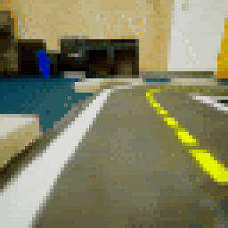

# Final Report

## Project Summary
Our project aims to develop an autonomous navigation system for a Duckiebot within the simulated Duckietown environment.
We strive to create a system with a strong emphasis on safety and adaptability.
With the current environment we are aiming for the agent to reliably preform lane following, staying reasonably centered throughout the entire route, from start to finish.
A 160x120 RGB visual feed is the primary input for the Duckiebot and provides the agent with critical context regarding lane positioning.
Based on the camera feed the system produces a continuous output in the form of linear and angular velocity commands to control the Duckiebot's movement, allowing it to navigate the field safely and responsivley.
Aiming to transfer the training agent to the physical Duckiebot we are comparing different RL algorithms to compare and discover which will give us the best result. 

The main challenge of this project is understanding how the Duckiebot interacts with the environment and establishing a way to enforce that the bot follows specific road rules
in its continuous state of movement. When launching the environment, the Duckiebot will randomly move in any direction without understanding whether moving that way was a bad or good decision.
With the unlimited possiblities of how the Duckiebot can move and its continuously changing position, we decided that utilizing RL algorithms would be the best and most practical approach to having the bot 
learn how to properly navigate the environment.

The main reason behind using AI/ML algorithms is that autonomous driving requires you to account for precise road rules while handling unpredictable conditions in the environment. For our Duckiebot, 
it must understand how to drive on the center of the road while accounting for the road curving left or right. This means that we must find a way to make the Duckiebot learn what the center of the road is 
and when the road is about to end, while encouraging it to move forward. Programming all these factors manually would be impractical, resulting in RL algorithms being the smarter choice to solve
this problem.

---

## Approach

Our team implemented and compared two distinct reinforcement learning approaches for autonomous driving in the Duckiebot simulator to identify the most robust solution for continuous action spaces. We focused on comparing an on-policy method, **Proximal Policy Optimization (PPO)**, with an off-policy method, **Soft Actor-Critic (SAC)**.

### Proximal Policy Optimization (PPO)
PPO was our primary method, chosen for its training stability. It utilizes a clipped objective function to prevent the policy from changing too drastically in a single update:

$$L^{CLIP}(\theta) = \hat{\mathbb{E}}_t \left[ \min(r_t(\theta) \hat{A}_t, \text{clip}(r_t(\theta), 1 - \epsilon, 1 + \epsilon) \hat{A}_t) \right]$$

Where $r_t(\theta)$ is the probability ratio, and $\hat{A}_t$ is the estimated advantage at time $t$.

### Soft Actor-Critic (SAC)
SAC was chosen for its superior sample efficiency in continuous action spaces. Unlike PPO, SAC aims to maximize both the expected reward and entropy to encourage exploration and prevent premature convergence:

$$J(\pi) = \sum_{t=0}^{T} \mathbb{E}_{(s_t, a_t) \sim \rho_\pi} [r(s_t, a_t) + \alpha \mathcal{H}(\pi(\cdot|s_t))]$$

Where $\mathcal{H}$ denotes the entropy and $\alpha$ is the temperature parameter.

---

### Implementation Details

#### 1. Observation & Action Space
* **Observations**: Raw images are resized and normalized to $64 \times 64 \times 3$. We utilize `VecTransposeImage` to convert data to a channel-first format and `VecFrameStack` with `n_stack=4` to allow the agent to perceive temporal information (motion and velocity) from consecutive frames.
* **Actions**: A continuous space representing `[linear_velocity, angular_velocity]`, with both values clipped between $[-1.0, 1.0]$.

#### 2. Advanced Reward Shaping

We implemented a custom `ImageWrapper` to refine the reward signal, transitioning from a basic set of heuristics to a sophisticated multi-weighted function to improve driving stability.

#### Configuration A: Simple Reward Function
The simple reward function was designed to provide basic corrections to the agent's movement by penalizing erratic behavior and rewarding forward intent.
* **Spin Penalty**: Penalizes the absolute value of the turning action by a factor of $0.3$ to discourage spinning.
* **Forward Bonus**: Provides a small incentive ($0.1 \times forward\_vel$) for positive forward velocity to encourage movement.
* **Turn Jerk**: Penalizes the difference between the current and previous turning actions by $0.1$ to encourage smoother steering and reduce jitter.

#### Configuration B: Custom Reward Function (Optimized)
The optimized custom reward function introduced more granular weights and environmental context to achieve stable lane following.
* **Progress (Weight: 3.0)**: Uses interpolation on the agent's actual forward velocity to provide a strong positive incentive for moving forward, helping the agent overcome the "stagnation trap."
* **Alignment (Weight: 1.5)**: Penalizes high yaw velocity to keep the Duckiebot parallel with the lane center, ensuring it follows the road's curve rather than driving into boundaries.
* **Smoothness (Weight: 0.8)**: Scales the steering change penalty to significantly reduce aggressive "wobbling" during navigation.
* **Spin Penalty (Weight: 0.4)**: Specifically targets angular velocity to ensure the agent does not default to circular motion to avoid boundaries.
* **Momentum Bonus**: An additional $+0.2$ reward is applied when the agent maintains a $forward\_vel > 0.3$ while keeping $abs(yaw\_vel) < 0.3$, rewarding high-speed stability on straightaways.
* **Termination**: A large penalty (ranging from $-5.0$ to $-100.0$ depending on the specific model run) and episode termination are applied immediately upon collision with lane boundaries.

### Hyperparameter Configurations

We evolved our hyperparameters across multiple training runs to find the best balance between exploration and stability. Our tuning process was split between optimizing PPO for long-term navigation and managing memory constraints for SAC.

#### 1. Proximal Policy Optimization (PPO)
Our final PPO configuration focused on increasing the batch size and learning rate to handle the high-dimensional input from the $64 \times 64 \times 3$ image wrapper.

<table style="width: 100%; border-collapse: collapse;">
  <tr style="background-color: #161b22; color: #ffffff;">
    <th align="left" style="border: 1px solid #30363d; padding: 12px;">Hyperparameter</th>
    <th align="left" style="border: 1px solid #30363d; padding: 12px;">Value</th>
    <th align="left" style="border: 1px solid #30363d; padding: 12px;">Rationale</th>
  </tr>
  <tr>
    <td style="border: 1px solid #30363d; padding: 10px;"><b>Learning Rate</b></td>
    <td style="border: 1px solid #30363d; padding: 10px;">3 × 10-4</td>
    <td style="border: 1px solid #30363d; padding: 10px;">Increased from 1 × 10-4 to accelerate convergence with custom rewards.</td>
  </tr>
  <tr>
    <td style="border: 1px solid #30363d; padding: 10px;"><b>n_steps</b></td>
    <td style="border: 1px solid #30363d; padding: 10px;">2048</td>
    <td style="border: 1px solid #30363d; padding: 10px;">Increased from 1024 to provide more stable gradient estimates per update.</td>
  </tr>
  <tr>
    <td style="border: 1px solid #30363d; padding: 10px;"><b>Batch Size</b></td>
    <td style="border: 1px solid #30363d; padding: 10px;">128</td>
    <td style="border: 1px solid #30363d; padding: 10px;">Increased from 64 to improve update stability in continuous action spaces.</td>
  </tr>
  <tr>
    <td style="border: 1px solid #30363d; padding: 10px;"><b>ent_coef</b></td>
    <td style="border: 1px solid #30363d; padding: 10px;">0.05</td>
    <td style="border: 1px solid #30363d; padding: 10px;">Set high to ensure the agent explored forward movement instead of spinning.</td>
  </tr>
  <tr>
    <td style="border: 1px solid #30363d; padding: 10px;"><b>Total Timesteps</b></td>
    <td style="border: 1px solid #30363d; padding: 10px;">2,000,000</td>
    <td style="border: 1px solid #30363d; padding: 10px;">Extended training duration to ensure behavior stabilization.</td>
  </tr>
</table>

**PPO Tuning Process:**
The primary challenge with PPO was the "stagnation trap," where the agent would spin in place to avoid collision penalties. By increasing the entropy coefficient ($ent\_coef$) to $0.05$ and adjusting the reward weights for forward progress, we forced the agent to explore the lane boundaries more effectively.

#### 2. Soft Actor-Critic (SAC)
Our SAC configuration focused on balancing sample efficiency, stability, and memory constraints while traning on high-dimensional image observations. Due to memory limits we adjusted key hyperparameters to prevent crashes while maintaining stable learning behaviour.

<table style="width: 100%; border-collapse: collapse;">
  <tr style="background-color: #161b22; color: #ffffff;">
    <th align="left" style="border: 1px solid #30363d; padding: 12px;">Hyperparameter</th>
    <th align="left" style="border: 1px solid #30363d; padding: 12px;">Value</th>
    <th align="left" style="border: 1px solid #30363d; padding: 12px;">Rationale</th>
  </tr>
  <tr>
    <td style="border: 1px solid #30363d; padding: 10px;"><b>learning_rate</b></td>
    <td style="border: 1px solid #30363d; padding: 10px;">1 × 10-4</td>
    <td style="border: 1px solid #30363d; padding: 10px;">Lowered from 3 × 10-4 to stabalize training with noisy image observations.</td>
  </tr>
  <tr>
    <td style="border: 1px solid #30363d; padding: 10px;"><b>buffer_size</b></td>
    <td style="border: 1px solid #30363d; padding: 10px;">50,000</td>
    <td style="border: 1px solid #30363d; padding: 10px;">Reduced to prevent out-of-memory (OOM) issues during long training runs.</td>
  </tr>
  <tr>
    <td style="border: 1px solid #30363d; padding: 10px;"><b>batch_size</b></td>
    <td style="border: 1px solid #30363d; padding: 10px;">128</td>
    <td style="border: 1px solid #30363d; padding: 10px;">Decreased from default 256 to reduce memory usage while mantaining stable updates.</td>
  </tr>
  <tr>
    <td style="border: 1px solid #30363d; padding: 10px;"><b>learning_starts</b></td>
    <td style="border: 1px solid #30363d; padding: 10px;">10,000</td>
    <td style="border: 1px solid #30363d; padding: 10px;">Delays training to ensure the replay buffer has sufficient diverse samples.</td>
  </tr>
   <tr>
    <td style="border: 1px solid #30363d; padding: 10px;"><b>gamma</b></td>
    <td style="border: 1px solid #30363d; padding: 10px;">0.98</td>
    <td style="border: 1px solid #30363d; padding: 10px;">SLightly reduced to priorotize more immediate rewards and imporve stability.</td>
  </tr>
  <tr>
    <td style="border: 1px solid #30363d; padding: 10px;"><b>Total Timesteps</b></td>
    <td style="border: 1px solid #30363d; padding: 10px;">500,000</td>
    <td style="border: 1px solid #30363d; padding: 10px;">Limited by compute and memory constraints but sufficient to observe convergence.</td>
  </tr>
</table>

**SAC Tuning Process:**
The primary challenge with SAC was "memory constraints", as larger replay buffers and batch sizes led to OOM crashes. Reducing the buffer size and batch size allowed for stable, longer training runs without exceeding hardware limits.

With insability in early training we lowered the learning rate and introduced a longer delay before updates. This ensured that the agent learned from a wide set of experiences. Slightly reducing the discount factor, gamma, also helped the agent focus more on immediate rewards, improving short-term control and lane-following behavior.

Wanting to ensure reproducibility, we fixed the random seed across runs. While stabalizing the action sampling, minor variations in observations remained due to the nature of the simulated enviorment.

---

## Evaluation

We evaluated our PPO and SAC configurations across four distinct training attempts for each algorithm, measuring performance through quantitative reward metrics and qualitative behavioral analysis in the DuckieTown simulator.

### 1. Proximal Policy Optimization (PPO) Evaluation

The PPO training evolved from baseline establishment to late-stage refinement using custom reward functions.

#### Early/Mid-Stage Training (Baseline and Initial Tuning)
* **Model 1 (Baseline)**: Utilizing 100,000 training steps and default hyperparameters, this model achieved a reward value of **-468.3351**.
* **Model 2 (Initial Tuning)**: Training was extended to 500,000 steps with a learning rate of $1 \times 10^{-4}$ and an entropy coefficient of $0.05$. This configuration resulted in a reward value of **-456.0184**.

<table style="width: 100%; border-collapse: collapse;">
  <tr>
    <td align="center" style="border: 1px solid #30363d; padding: 10px; width: 50%;">
      
    </td>
    <td align="center" style="border: 1px solid #30363d; padding: 10px; width: 50%;">
      
    </td>
  </tr>
  <tr style="background-color: #161b22; color: #ffffff;">
    <td align="center" style="border: 1px solid #30363d; padding: 8px;">
      <b>Model 1 (Baseline)</b>
    </td>
    <td align="center" style="border: 1px solid #30363d; padding: 8px;">
      <b>Model 2 (Initial Tuning)</b>
    </td>
  </tr>
</table>

#### Late-Stage Training (Reward Refinement)
* **Model 3 (Extended Training with Simple Reward)**: With 1,000,000 training steps and the "simple" reward function, performance improved to a reward of **-141.3634**.
* **Model 4 (Optimized Custom Reward)**: Maintaining the same hyperparameters as Model 3 but implementing a "custom" reward function, the agent achieved a breakthrough positive reward of **83.9519**. This version demonstrated the most stable and centered lane-following behavior.

<table style="width: 100%; border-collapse: collapse;">
  <tr>
    <td align="center" style="border: 1px solid #30363d; padding: 10px; width: 50%;">
      
    </td>
    <td align="center" style="border: 1px solid #30363d; padding: 10px; width: 50%;">
      
    </td>
  </tr>
  <tr style="background-color: #161b22; color: #ffffff;">
    <td align="center" style="border: 1px solid #30363d; padding: 8px;">
      <b>Model 3 (Extended Training with Simple Reward)</b>
    </td>
    <td align="center" style="border: 1px solid #30363d; padding: 8px;">
      <b>Model 4 (Optimized Custom Reward)</b>
    </td>
  </tr>
</table>

### 2. Soft Actor-Critic (SAC) Evaluation

SAC evaluation focused on overcoming hardware constraints and exploration issues through seeding and hyperparameter modification.

#### Early Stage (Baseline and Modified Parameters)
* **Model 1 (Default SAC)**: Using default parameters over 100,000 timesteps, the agent achieved an initial reward of **-418.5**.
* **Model 2 (Modified Hyperparameters)**: Training was extended to 500,000 timesteps with an increased learning rate of $3 \times 10^{-4}$ and a buffer size of 200,000. This configuration initially struggled, resulting in a reward of **-2551**.

<table style="width: 100%; border-collapse: collapse;">
  <tr>
    <td align="center" style="border: 1px solid #30363d; padding: 10px; width: 50%;">
      
    </td>
    <td align="center" style="border: 1px solid #30363d; padding: 10px; width: 50%;">
      
    </td>
  </tr>
  <tr style="background-color: #161b22; color: #ffffff;">
    <td align="center" style="border: 1px solid #30363d; padding: 8px;">
      <b>Model 1 (Default SAC)</b>
    </td>
    <td align="center" style="border: 1px solid #30363d; padding: 8px;">
      <b>Model 2 (Modified Hyperparameters)</b>
    </td>
  </tr>
</table>

#### Mid and Final Stages (Seeding and Custom Rewards)
* **Model 3 (Mid-Stage SEEDING)**: To stabilize training, domain randomization and camera location randomization were disabled. With a smaller buffer size (50,000) and lower learning rate ($1 \times 10^{-4}$), the model reached a reward of **1514**.
* **Model 4 (Final Stage Custom Reward)**: Building on the seeded environment, a custom reward function was applied. There are two runs. The "Gray" run achieved the highest SAC reward of **2493**, while the "Orange" run (with modified forward weighting) achieved **1403**.

<table style="width: 100%; border-collapse: collapse;">
  <tr>
    <td align="center" style="border: 1px solid #30363d; padding: 10px; width: 33.33%;">
      
    </td>
    <td align="center" style="border: 1px solid #30363d; padding: 10px; width: 33.33%;">
      
    </td>
    <td align="center" style="border: 1px solid #30363d; padding: 10px; width: 33.33%;">
      
    </td>
  </tr>
  <tr style="background-color: #161b22; color: #ffffff;">
    <td align="center" style="border: 1px solid #30363d; padding: 8px;">
      <b>Model 3 (Mid-Stage SEEDING)</b>
    </td>
    <td align="center" style="border: 1px solid #30363d; padding: 8px;">
      <b>Model 4 (Final Stage Custom Reward / Gray)</b>
    </td>
    <td align="center" style="border: 1px solid #30363d; padding: 8px;">
      <b>Model 4 (Final Stage Custom Reward / Orange)</b>
    </td>
  </tr>
</table>

### Final Comparison and Insights
* **Behavioral Progression**: Baseline models often fell into the "stagnation trap," spinning in place to avoid penalties. Policy refinement and custom reward shaping were essential to achieving consistent forward progress and trajectory smoothness.
* **Training Stability**: PPO demonstrated more consistent convergence during late-stage refinement compared to SAC, which showed higher sensitivity to buffer sizes and learning starts.
* **Performance Peak**: Model 4 for PPO (using 1,000,000 steps and custom rewards) and Model 3 for SAC (Mid-Stage SEEDING) represented the most successful configurations for autonomous navigation.

---

## Resources Used
- SAC Documentation: https://stable-baselines3.readthedocs.io/en/master/modules/sac.html
- PPO Documentation: https://stable-baselines3.readthedocs.io/en/master/modules/ppo.html
- Custom Reward: https://github.com/marton12050/T.T-duckietown
- duckiebotssim : https://gitlab.jblanier.net/sim2real/duckiebotssim/-/tree/master
- AI Tools: We utilized Generative AI tools (Gemini/ChatGPT) to assist in debugging the `duckiebotssim` environment wrappers and to troubleshoot errors within our reinforcement learning training scripts.

## Progress Video
<iframe width="560" height="315" src="https://www.youtube.com/embed/-cZzBRPxu5M?si=gbzZBSAsnnrsB-rR" title="YouTube video player" frameborder="0" allow="accelerometer; autoplay; clipboard-write; encrypted-media; gyroscope; picture-in-picture; web-share" referrerpolicy="strict-origin-when-cross-origin" allowfullscreen></iframe>